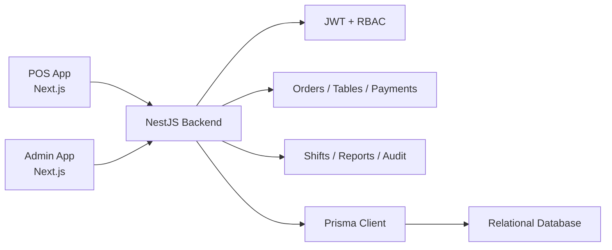

# Cafe POS

[](https://github.com/teflakeii/cafe-pos/actions/workflows/ci.yml)

Cafe POS is a full-stack point-of-sale and back-office management system for small cafes. It includes a cashier-facing POS, an admin dashboard, and a NestJS backend with Prisma-managed persistence.

## Overview

The project demonstrates a production-style TypeScript monorepo with separate applications for operations and administration:

- POS app for table orders, payments, and cashier workflows.
- Admin dashboard for shifts, users, reports, menu, expenses, and settings.
- Backend API for RBAC, orders, payments, shifts, audit logs, and financial reporting.
- Prisma migrations that show the schema evolving over time.

## Problem

Small cafe teams need fast table service, clear shift accountability, consistent payment handling, and reliable daily reports. Cafe POS models these workflows in a maintainable full-stack architecture.

## Features

- Role-based login for owner, manager, cashier, and accountant workflows.
- Table management and active order tracking.
- Menu and category management.
- Payment allocation and settlement workflows.
- Shift opening, closeout, snapshots, and audit protection.
- Daily, range, and shift reports.
- Expense module and financial ledger.
- Admin user management and settings.

## Tech Stack

- Monorepo: pnpm workspaces
- Backend: NestJS, Prisma, JWT, bcrypt, Jest, Supertest
- Frontend: Next.js, React, TypeScript, Tailwind CSS
- Database: Prisma schema targeting relational persistence
- Quality: ESLint, TypeScript builds, GitHub Actions

## Architecture



## Folder Structure

```text
apps/backend/   NestJS API, Prisma schema, migrations, tests
apps/pos/       Cashier/table-service Next.js app
apps/admin/     Admin dashboard Next.js app
pnpm-workspace.yaml
```

## Screenshots


## Demo

No hosted demo is currently published. Run the local stack with the commands below.

## Installation

```bash
pnpm install
```

## Environment Variables

Create local `.env` files outside version control. Required backend variables include:

- `DATABASE_URL`
- `JWT_SECRET`
- `SEED_OWNER_PASSWORD`
- `SEED_MANAGER_PASSWORD`
- `SEED_CASHIER_PASSWORD`
- `SEED_ACCOUNTANT_PASSWORD`

## Docker

Docker packaging is not included yet. The current deployment path is a Node.js runtime plus a relational database configured through Prisma.

## Testing

```bash
pnpm test
pnpm lint
pnpm build
```

## Deployment

Recommended production baseline:

- Managed PostgreSQL or compatible relational database.
- Strong `JWT_SECRET`.
- Seed credentials provided only through deployment secrets.
- CI checks passing before deploy.
- Database migrations reviewed before rollout.

## Roadmap

- Add Docker Compose for local infrastructure.
- Add Playwright smoke tests for POS and admin flows.
- Add screenshots and a short demo recording.
- Add deployment guide for a production host.
