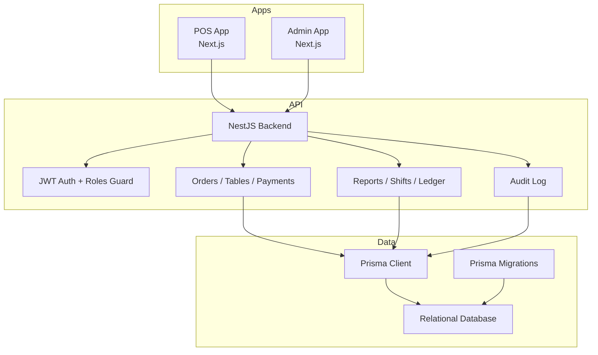
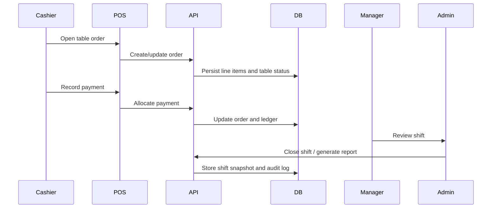

# Cafe POS Architecture

```mermaid
flowchart TB
  subgraph Apps
    POS["POS App<br/>Next.js"]
    Admin["Admin App<br/>Next.js"]
  end

  subgraph API
    Nest["NestJS Backend"]
    Auth["JWT Auth + Roles Guard"]
    Orders["Orders / Tables / Payments"]
    Reports["Reports / Shifts / Ledger"]
    Audit["Audit Log"]
  end

  subgraph Data
    Prisma["Prisma Client"]
    Migrations["Prisma Migrations"]
    DB["Relational Database"]
  end

  POS --> Nest
  Admin --> Nest
  Nest --> Auth
  Nest --> Orders
  Nest --> Reports
  Nest --> Audit
  Orders --> Prisma
  Reports --> Prisma
  Audit --> Prisma
  Prisma --> DB
  Migrations --> DB
```

## Operational Flow

```mermaid
sequenceDiagram
  participant Cashier
  participant POS
  participant API
  participant DB
  participant Manager
  participant Admin

  Cashier->>POS: Open table order
  POS->>API: Create/update order
  API->>DB: Persist line items and table status
  Cashier->>POS: Record payment
  POS->>API: Allocate payment
  API->>DB: Update order and ledger
  Manager->>Admin: Review shift
  Admin->>API: Close shift / generate report
  API->>DB: Store shift snapshot and audit log
```
